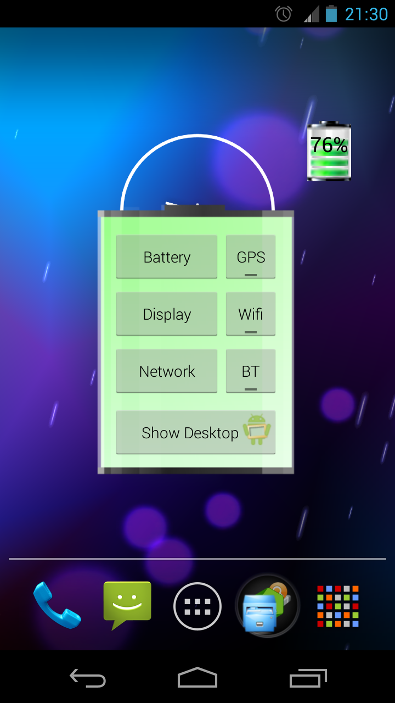

# Battery Widget




This project is based on Battery Widget by Richard Hyndman.  The original open source project became closed source from v1.7.3.


Graphical Battery Widget shows the exact battery level in 1x1 space, with shortcuts to Power-Summary/Display/Network/GPS/Wifi/BT Settings and 'Show Desktop' feature to shows your wallpaper/live-wallpaper in full screen.

**Note:**
This doesn't open, it is a Widget not an app.  Add to homescreen with

- Menu -> Add -> Widgets -> Battery Widget or
- Apps -> Widgets -> Battery Widget or
- Long press homescreen -> Widgets -> Battery Widget


## Installation
On Android 8.0 (Oreo) or above, if upon adding Battery Widget to the homescreen, the widget show 0% or stop updating, this is likely be related to the battery optimization feature introduced in Android 8.0, to fix this, disable battery optimization for Battery Widget by

- Battery Widget: App info -> Battery optimization -> Don't optimize

then

- Remove all Battery Widget instance from homescreen.
- Re-add Battery Widget to homescreen.


## Download
<a href="https://play.google.com/store/apps/details?id=gyu.geekyouup.android.widgets.battery">
  
</a>


## Acknowledgements
- Thanks to Richard Hyndman for [Battery Widget](http://code.google.com/p/batterywidget).


## License
```
Battery Widget - Android Home Screen Battery Widget
Copyright (c) 2014-2020 HairyRobot

This program is free software: you can redistribute it and/or modify
it under the terms of the GNU General Public License as published by
the Free Software Foundation, either version 3 of the License, or
(at your option) any later version.

This program is distributed in the hope that it will be useful,
but WITHOUT ANY WARRANTY; without even the implied warranty of
MERCHANTABILITY or FITNESS FOR A PARTICULAR PURPOSE.  See the
GNU General Public License for more details.

You should have received a copy of the GNU General Public License
along with this program.  If not, see <http://www.gnu.org/licenses/>.
```
